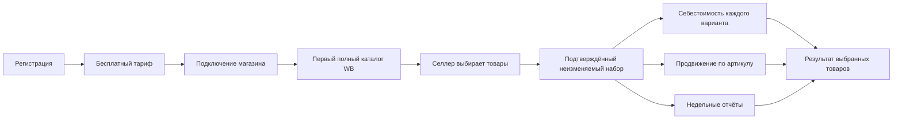
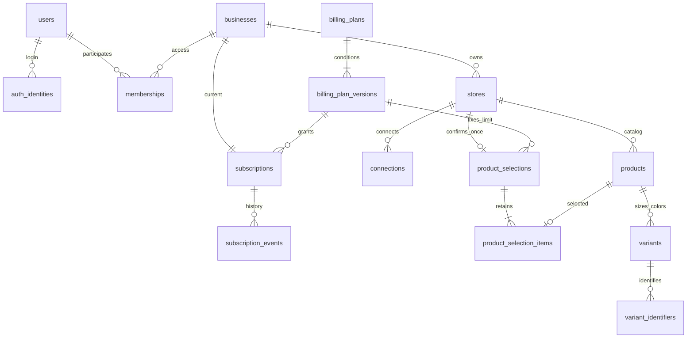
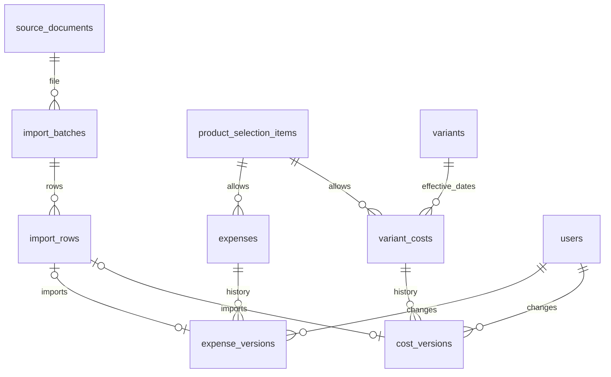
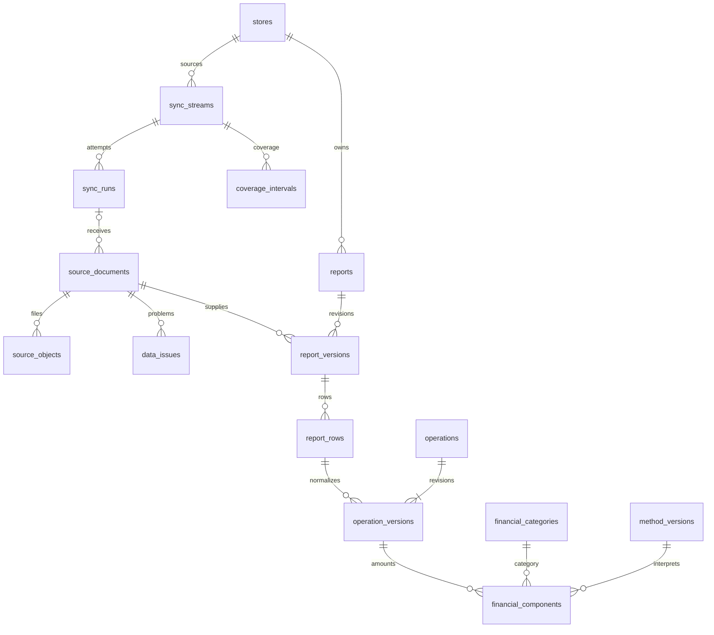
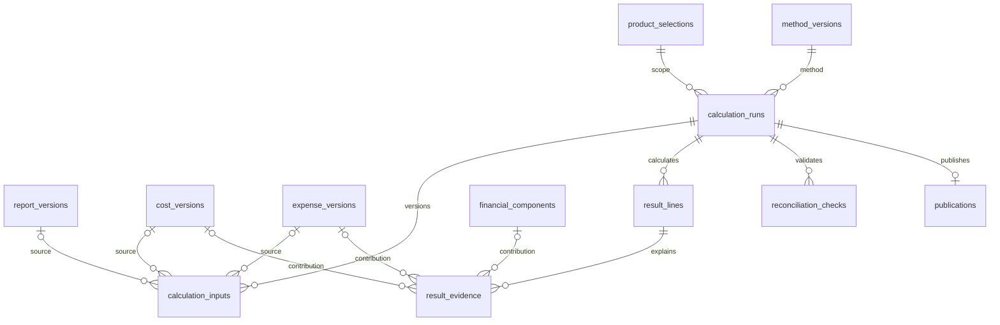
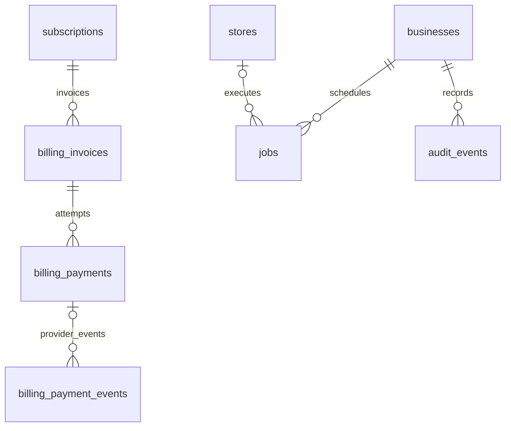

# Marketplace Control — первая итерация базы данных

11 сентября 2026 года. Созданы миграция PostgreSQL, проверки и словарь полей. Рабочий сервер БД, интерфейс, интеграция WB и приём платежей не запускались.

## Что входит

**47 таблиц и 3 представления** охватывают первый MVP: пользователей, магазины, каталог и варианты, тарифы, подтверждённый выбор товаров, импорт себестоимости и продвижения, недельные отчёты, финансовые операции, версии расчётов и служебные задания.

- [Полный словарь таблиц, полей, допустимых значений и связей](database-v1-dictionary.md).
- [SQL-миграция](../db/migrations/001_initial.sql).
- [Применение, доступ и ограничения](../db/README.md).

## Пользовательский сценарий

Товар сопоставляется по числовому артикулу WB в магазине, отображается под артикулом продавца. Варианты сохраняют размер/цвет и отдельную стоимость. Магазин подставляется в импорт из контекста; его ID не нужен в файле.

## Доступ, тарифы и закрепление товаров

| Тариф | Товаров на бизнес | Магазинов | Цена |
|---|---:|---:|---|
| Бесплатный | 3 | 1 | 0 ₽ |
| Минимальный | 10 | 1 | Не задана |
| Плюс | 100 | 2 | Не задана |
| Про | 1 000 | 2 | Не задана |

Количество тарифов и их лимиты — данные, а не фиксированный перечень в программном коде. Разделения функций по тарифам нет. Изменение условий создаёт новую версию.

Один артикул с десятью размерами занимает одно место. Лимит суммарный между магазинами. Выбор пользователя проходит атомарно; при ошибке не остаётся части набора. Повторный вход, импорт или восстановление подключения не сбрасывают его.

Отдельная таблица `product_access` пока не нужна: сохранённые `product_selection_items` вместе с активной подпиской определяют доступ через представления. Это исключает два противоречащих друг другу списка выбранных и разрешённых товаров.

## Импорт и пользовательские затраты

Себестоимость действует с заданной даты до следующей даты стоимости этого варианта. Исправление суммы сохраняет старую версию. Отсутствие стоимости не равно нулю.

Продвижение сохраняется одной суммой на артикул за период. Оно не копируется на каждый размер. Признание расхода поддерживает отдельную дату либо равномерное распределение по периоду; метод выбирается явно. Автоматическое распределение между товарами в этой итерации отсутствует.

## Источники и финансовые операции

Исходные файлы находятся в объектном хранилище, в БД — постоянные ключи объектов и контрольные суммы. Фактическое хранилище ещё не подключено.

Недельный отчёт хранится версиями. Повтор содержимого и строк не создаёт второй расход. `srid` не уникален: он предназначен для связи операций, а не удаления дублей.

Полный отчёт может включать другие товары и общие расходы магазина. Они сохраняются как исходные данные для сверки, но не выдаются как аналитика неподключённых товаров и не приписываются выбранным без связи. Итог называется **«Результат выбранных товаров»**, не результатом всего магазина.

## Расчёт и происхождение каждой суммы

Каждая строка результата связана с подтверждающими суммами. Завершить расчёт нельзя, если расшифровка не сходится, расход задвоен, использована стоимость другого варианта или источник отсутствует среди входов расчёта.

В одном расчёте нельзя смешать две версии одного отчёта. Выплаты от площадки не становятся строками прибыли. Итог строится по учётным датам операций, включая недели на границе месяцев.

Первый вариант публикации — полный пересчёт загруженной истории магазина. Новая публикация переключается в транзакции. Успешный расчёт неизменяем; корректировки создают новый. Частичные пересчёты и отдельные таблицы агрегатов добавляются при необходимости.

## Платежи и фоновые процессы

Уникальные ключи защищают от повторных платежных событий и одновременного создания одинаковых заданий. Сами платежи и воркер не реализованы. Секреты не хранятся в открытом виде и не включаются в аудит.

## Расширение проекта

| Будущий модуль | Точки подключения к текущей БД |
|---|---|
| Заказы, выкупы, возвраты | `stores`, `products`, `variants`, `operations`, `source_documents` |
| Рекламные кампании и статистика | `products`, `expenses`, `financial_components`, `source_documents` |
| Остатки, склады и поставки | `variants`, `source_documents`; оценка через `cost_versions` |
| Капитал | Оценка запасов и `calculation_runs` |
| Региональная аналитика | Подтверждённые связи заказов/операций; отдельные региональные измерения |
| Налоги | Настройки уровня `businesses`, версии методики и входы из магазинов |
| Ситуации и контрольные точки | `products`, `calculation_runs`, будущие оперативные данные |
| Возвраты платежей и развитие подписок | `billing_payments`, `subscription_events` |

Эти модули пока не создают пустые таблицы. Расширение идёт новыми миграциями, с типизированными связями и версионными входами. Не требуется заменять финансовый реестр универсальной JSON-таблицей или разделять MVP на микросервисы.

## Проверки и границы готовности

Пройдено **55 проверок** на PostgreSQL 17.5 внутри PGlite: применение схемы; тарифы и лимиты; сохранение выбранного набора; связи бизнеса/магазина/варианта; история стоимости; дубли отчётов и расходов; расшифровка; изоляция RLS под ролью, не являющейся владельцем; закрытие представлений при окончании подписки.

На постоянном сервере миграция пока не применена. Нагрузочные и конкурентные проверки нескольких соединений не выполнялись. Словарь полей сформирован из реально применённой тестовой схемы.

Открытые решения сохранены явно:

- цены платных тарифов и платёжный провайдер;
- правила добора товаров после повышения тарифа и снижения лимита;
- действия после окончания подписки;
- проверка идентификаторов вариантов и исправлений отчётов WB;
- финансовая методика, себестоимость возвратов и полнота затрат.

В этой итерации повторный выбор и добор после подтверждения заблокированы. Понижение ниже сохранённого набора также заблокировано. Данные не удаляются. Эти ограничения не подменяют согласование дальнейших продуктовых правил.
