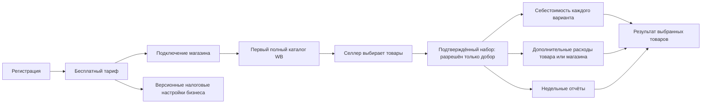
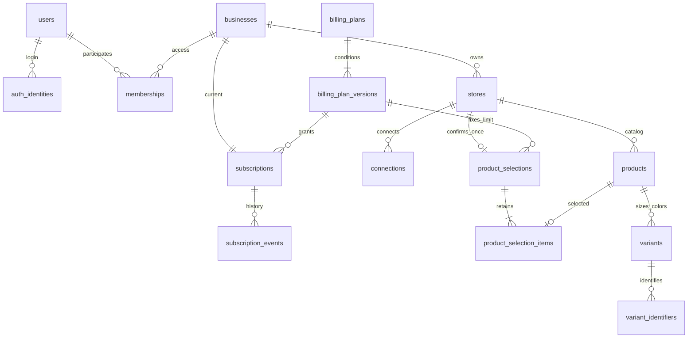
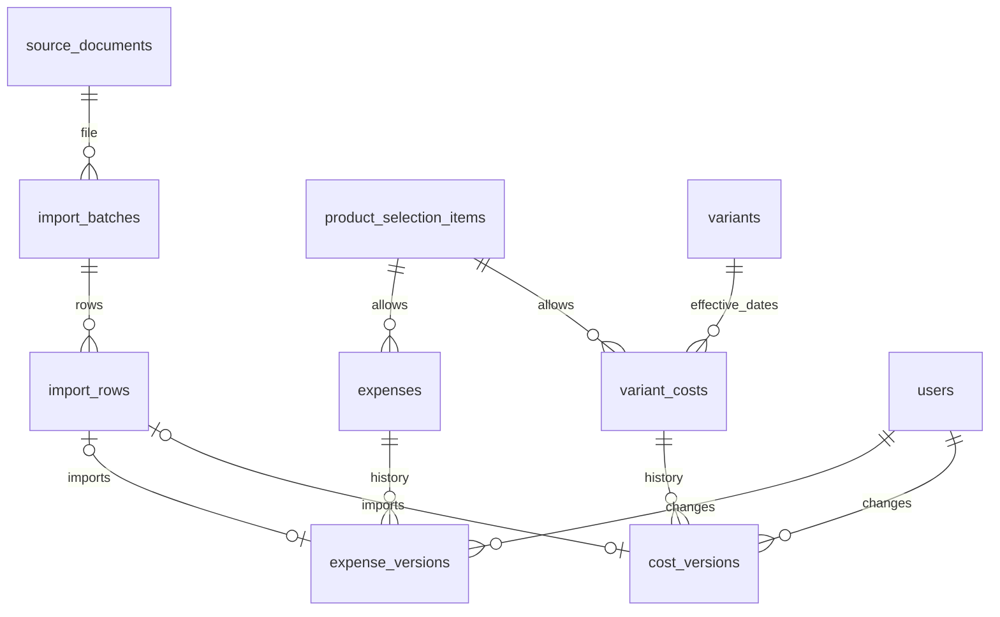
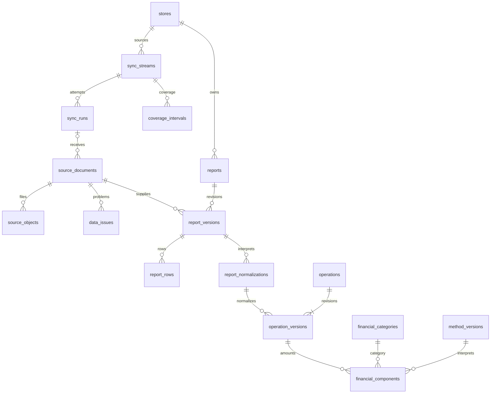
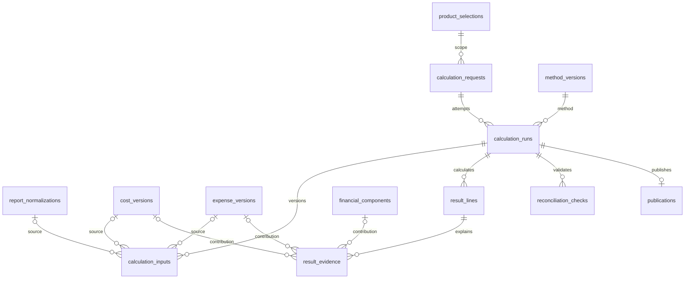
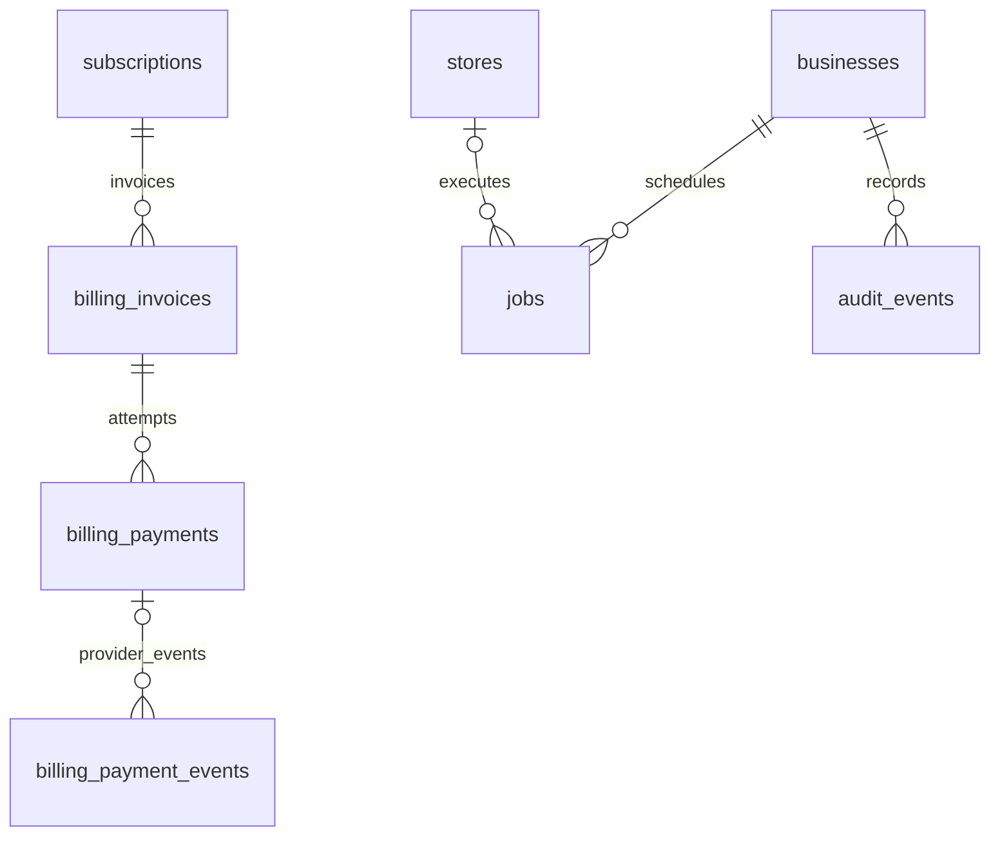

# Marketplace Control — первая итерация базы данных

Миграция 078 добавляет закрытое зеркало `calculation_dispatch` для фонового обнаружения и подтверждения запросов расчёта без ослабления FORCE RLS исходной таблицы. [Контракт и проверки](financial-calculation-dispatch-2026-10-07.md).

Миграция 079 добавляет `absent` для старых недель без отчётов в полном списке WB и отделяет почасовое ожидание свежего отчёта от первоначальной истории. Готовность оперативной загрузки проверяет приёмку реально найденных отчётов; историческое отсутствие не создаёт финансовый ноль. [Контракт и проверки](financial-history-inventory-2026-10-07.md).

Актуально на 25 сентября 2026 года. Исходная модель развивается последовательными миграциями; актуальное приложение, PostgreSQL и интеграция WB работают на выделенной VM без Docker.

Миграции `001`–`017` покрывают исходную схему, аутентификацию, подключения и синхронизации WB, выбор товаров, финансовые отчёты, себестоимость, дополнительные расходы, налоговые настройки, воспроизводимый расчёт P0.3 и сохранённую оценку УСН по выбранным SKU. Локальная PGlite-проверка дополняет, но не заменяет итоговый прогон на VM.

Дополнение от 6 октября: миграция [073](../db/migrations/073_tariff_profile_foundation.sql) подготавливает отдельное хранение профилей тарифов, их магазинов и товаров. Старый выбор сохраняется для финансовых ссылок. Существующий платный набор переносится снимком; недоказанный первоначальный бесплатный выбор остаётся пустым. Приведённый ниже сценарий действующего доступа пока сохраняется: переключение потребителей, сроки и восстановление будут включены по [плану тарифного цикла](tariff-lifecycle-plan.md).

## Что входит

**72 таблицы и 4 представления** охватывают первый MVP: пользователей, подтверждение регистрации, лимиты и сессии, магазины, каталог и варианты, тарифы, подтверждённый выбор товаров, импорт себестоимости и расходов, налоговые настройки, недельные отчёты, версионные нормализации, финансовые операции, operational snapshot, durable invalidations, поколения и попытки расчётов, налоговые доказательства и служебные задания.

- [Полный словарь таблиц, полей, допустимых значений и связей](database-v1-dictionary.md).
- [Исходная SQL-миграция](../db/migrations/001_initial.sql), [налоги/дополнительные расходы](../db/migrations/011_user_financial_inputs.sql), [воспроизводимый расчёт P0.3](../db/migrations/012_financial_calculation.sql), [сохранённый налог](../db/migrations/017_selected_sku_tax_results.sql), [проблемы данных](../db/migrations/018_data_issue_lifecycle.sql), [недельные результаты](../db/migrations/019_p03_period_return_results.sql) и [оперативные версии](../db/migrations/020_operational_sales_funnel.sql).
- [Применение, доступ и ограничения](../db/README.md).

## Пользовательский сценарий

Товар сопоставляется по числовому артикулу WB в магазине, отображается под артикулом продавца. Варианты сохраняют размер/цвет и отдельную стоимость. Магазин подставляется в импорт из контекста; его ID не нужен в файле.

## Доступ, тарифы и закрепление товаров

| Тариф | Товаров на бизнес | Магазинов | Цена |
|---|---:|---:|---|
| Бесплатный | 3 | 1 | 0 ₽ |
| Минимальный | 10 | 1 | Не задана |
| Плюс | 100 | 2 | Не задана |
| Про | 1 000 | 2 | Не задана |

Количество тарифов и их лимиты — данные, а не фиксированный перечень в программном коде. Разделения функций по тарифам нет. Изменение условий создаёт новую версию.

Один артикул с десятью размерами занимает одно место. Лимит суммарный между магазинами. Выбор пользователя проходит атомарно; при ошибке не остаётся части набора. Повторный вход, импорт или восстановление подключения не сбрасывают его.

Отдельная таблица `product_access` пока не нужна: сохранённые `product_selection_items` вместе с активной подпиской определяют доступ через представления. Это исключает два противоречащих друг другу списка выбранных и разрешённых товаров.

## Импорт и пользовательские затраты

Себестоимость действует с заданной даты до следующей даты стоимости этого варианта. Исправление суммы сохраняет старую версию. Отсутствие стоимости не равно нулю.

Продвижение сохраняется одной суммой на артикул за период. Оно не копируется на каждый размер. Признание расхода поддерживает отдельную дату либо равномерное распределение по периоду; метод выбирается явно. Автоматическое распределение между товарами в этой итерации отсутствует.

Общий дополнительный расход хранится без `product_id`; связанный расход обязан ссылаться на выбранный товар того же магазина. Налоговые настройки действуют на уровне бизнеса и версионируются по дате начала. Режим и НДС являются независимыми параметрами: отсутствие настройки или неподдерживаемая методика не означает нулевой налог.

## Источники и финансовые операции

Исходные файлы находятся в объектном хранилище, в БД — постоянные ключи объектов и контрольные суммы. Фактическое хранилище ещё не подключено.

Недельный отчёт хранится версиями. Повтор содержимого и строк не создаёт второй расход. `srid` не уникален: он предназначен для связи операций, а не удаления дублей.

Полный отчёт может включать другие товары и общие расходы магазина. Они сохраняются как исходные данные для сверки, но не выдаются как аналитика неподключённых товаров и не приписываются выбранным без связи. Итог называется **«Результат выбранных товаров»**, не результатом всего магазина.

## Расчёт и происхождение каждой суммы

Каждое поколение закрепляет fingerprint, snapshot выбранных товаров и точные версии нормализаций, себестоимости, расходов и налоговых настроек. Каждая строка результата связана с подтверждающими суммами. Завершить расчёт нельзя, если расшифровка не сходится, расход задвоен, использована стоимость другого варианта или источник отсутствует среди входов расчёта.

В одном расчёте нельзя смешать две версии одного отчёта. Выплаты от площадки не становятся строками прибыли. Итог строится по учётным датам операций, включая недели на границе месяцев.

Первый вариант публикации — полный пересчёт загруженной истории магазина. Новая публикация переключается в транзакции. Успешный расчёт неизменяем; корректировки создают новый. Частичные пересчёты и отдельные таблицы агрегатов добавляются при необходимости.

## Платежи и фоновые процессы

Уникальные ключи защищают от повторных платежных событий и одновременного создания одинаковых заданий. Сами платежи и воркер не реализованы. Секреты не хранятся в открытом виде и не включаются в аудит.

## Расширение проекта

| Будущий модуль | Точки подключения к текущей БД |
|---|---|
| Заказы, выкупы, возвраты | `stores`, `products`, `variants`, `operations`, `source_documents` |
| Рекламные кампании и статистика | `products`, `expenses`, `financial_components`, `source_documents` |
| Остатки, склады и поставки | `variants`, `source_documents`; оценка через `cost_versions` |
| Капитал | Оценка запасов и `calculation_runs` |
| Региональная аналитика | Подтверждённые связи заказов/операций; отдельные региональные измерения |
| Налоги | Настройки уровня `businesses`, версии методики и входы из магазинов |
| Ситуации и контрольные точки | `products`, `calculation_runs`, будущие оперативные данные |
| Возвраты платежей и развитие подписок | `billing_payments`, `subscription_events` |

Эти модули пока не создают пустые таблицы. Расширение идёт новыми миграциями, с типизированными связями и версионными входами. Не требуется заменять финансовый реестр универсальной JSON-таблицей или разделять MVP на микросервисы.

## Проверки и границы готовности

Пройдено **106 проверок** на PostgreSQL 17.5 внутри PGlite: применение всех миграций; тарифы и лимиты; выбранный набор; связи бизнеса/магазина/варианта; версии стоимости, расходов и налоговых настроек; durable invalidation; версионная нормализация; frozen snapshot расчёта; недельные totals и quality; доказательства себестоимости, возврата и налога; однократный вычет УСН; дубли отчётов; расшифровка; аудит; FORCE RLS и изоляция арендаторов; закрытие представлений при окончании подписки.

Итог каждой поставки применяется и проверяется на выделенной VM. Локальная проверка не заменяет конкурентные и сквозные сценарии на целевом PostgreSQL. Словарь полей формируется из реально применённой тестовой схемы.

Открытые решения сохранены явно:

- цены платных тарифов и платёжный провайдер;
- правила добора товаров после повышения тарифа и снижения лимита;
- действия после окончания подписки;
- проверка идентификаторов вариантов и исправлений отчётов WB;
- расширение доказательного allowlist удержаний WB по новым ненулевым реальным образцам;
- полнота внешних затрат, которые приложение не может узнать из API WB.

После подтверждения набора разрешён контролируемый добор товаров в пределах актуального тарифа. Прежние позиции нельзя удалить или заменить, а понижение тарифа ниже сохранённого набора заблокировано. Данные не удаляются.

## Удаление аккаунта и акции (076–077)

Миграция 076 добавляет закрытый транзакционный допуск удаления неизменяемых tenant-данных и отдельную очередь очистки файлов без FK к удалённому бизнесу. Tenant FK остаются INITIALLY IMMEDIATE, но допускают отложенную проверку внутри eraser для циклических историй. Миграция 077 добавляет `mc.campaign_grants` и приватную схему `mc_campaign_private` с определениями акций и неизменяемыми HMAC-записями использованного права. Приватный реестр не удаляется вместе с аккаунтом и не включён в пользовательские read-маршруты. Состав, привилегии и ограничения — [контракт](account-erasure-and-campaigns.md).
